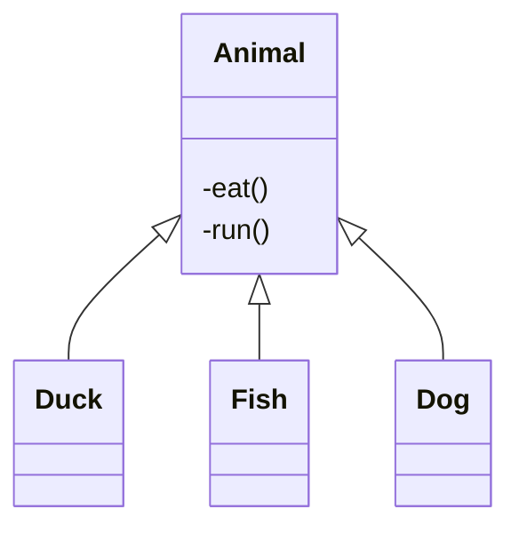

# AOP

Aspect oriented programming 面向切面编程，AOP 是 OOP（面向对象编程）的一种延续。

面向切面编程将重复的代码抽取出来，在运行的时候往业务代码上动态的植入**横切逻辑代码**。

##  AOP 的由来

面向对象编程是垂直纵向的继承体系，如下所示

通过继承，减少了重复的 eat、run 方法。 但是父类中的多个方法，会有重复的非业务代码。比如要记录这个方法执行了多少时间、记录日志等。这部分重复的代码一般被称为横切逻辑代码。

横切逻辑代码存在的问题：

- 代码重复
- 横切逻辑代码和业务代码混杂在一起，代码臃肿，不易维护

AOP 就是用来解决这种问题的。AOP 另辟蹊径，提出横向抽取机制，将横切逻辑代码和业务逻辑代码分离。

## AOP 有什么用

在不产生重复代码的情况下，添加功能。

### AOP 为什么叫面向切面编程

AOP 的思想将业务逻辑代码和横切逻辑代码切开，就像一个切面。

## 如何实现 AOP

通过代理的方式实现 AOP。

1. JDK 的 proxy， 通过接口实现代理。
2. cglib 通过继承实现代理。

