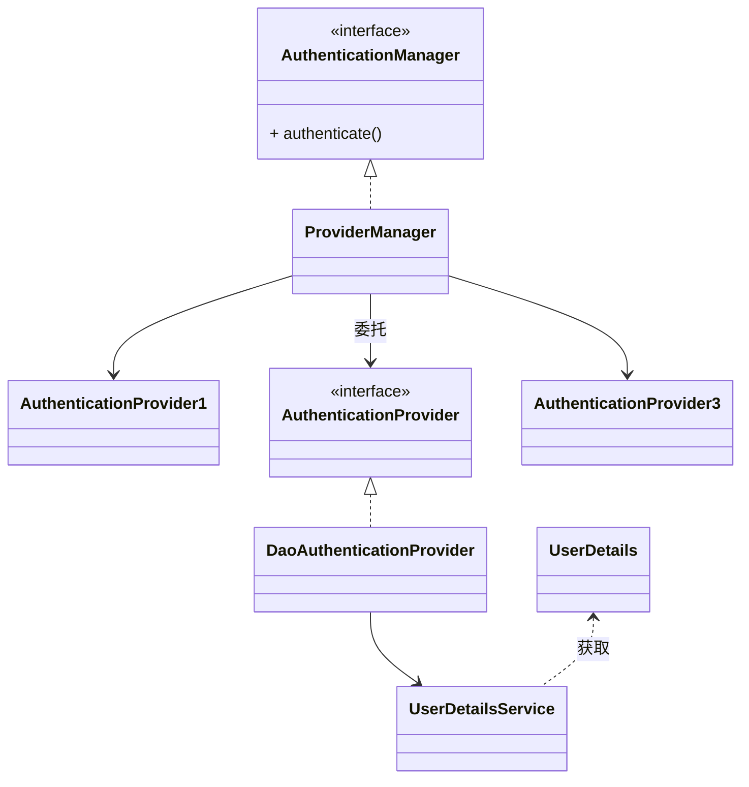
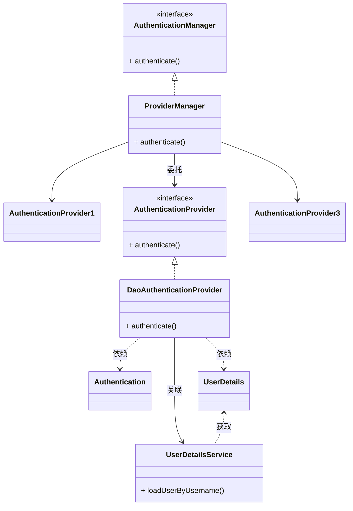

#  Architecture Overview

[原文](http://www.iocoder.cn/Spring-Security/laoxu/Architecture-Overview/)

介绍技术的文章，大多数是Code First，提出一个需求，介绍一个思路，解决一个问题，分析一下源码，大多如此。而学习一个体系的技术，我推荐 Architecture /ˈɑːr.kə.tek.tʃɚ/ First





## 1、核心组件

### 1.1  SecurityContextHolder

`SecurityContextHolder`用于存储安全上下文（security context）的信息。当前操作的用户是谁，该用户是否已经被认证，他拥有哪些角色权限…这些都被保存在SecurityContextHolder中。

`SecurityContextHolder`默认使用`ThreadLocal` 策略来存储认证信息。看到`ThreadLocal` 也就意味着，这是一种与线程绑定的策略。Spring Security在用户登录时自动绑定认证信息到当前线程，在用户退出时，自动清除当前线程的认证信息


**获取用户信息**

因为身份信息是与线程绑定的，所以可以在程序的任何地方使用静态方法获取用户信息。一个典型的获取当前登录用户的姓名的例子如下所示：

```java
Object principal = SecurityContextHolder.getContext().getAuthentication().getPrincipal();if (principal instanceof UserDetails) {    String username = ((UserDetails)principal).getUsername();} else {    String username = principal.toString();}
```

getAuthentication() 返回了认证信息，再次 getPrincipal() 返回了身份信息，UserDetails 便是 Spring 对身份信息封装的一个接口。Authentication


###  1.2 Authentication

接口源码

```java
package org.springframework.security.core;// <1>

public interface Authentication extends Principal, Serializable { // <1>
    Collection<? extends GrantedAuthority> getAuthorities(); // <2>

    Object getCredentials();// <2>

    Object getDetails();// <2>

    Object getPrincipal();// <2>

    boolean isAuthenticated();// <2>

    void setAuthenticated(boolean var1) throws IllegalArgumentException;
}
```

- getAuthorities()，权限信息列表，默认是 GrantedAuthority 接口的一些实现类，通常是代表权限信息的一系列字符串。
- getCredentials()，密码信息，用户输入的密码字符串，在认证过后通常会被移除，用于保障安全。
- getDetails()，细节信息，web 应用中的实现接口通常为 WebAuthenticationDetails，它记录了访问者的 ip 地址和 sessionId 的值。
- getPrincipal()，敲黑板！！！最重要的身份信息，大部分情况下返回的是 UserDetails 接口的实现类，也是框架中的常用接口之一。UserDetails 接口将会在下面的小节重点介绍。


### 1.3 AuthenticationManager

AuthenticationManager（接口）是认证相关的核心接口，也是发起认证的出发点。

在实际需求中，我们可能会允许用户使用用户名+密码登录，同时允许用户使用邮箱+密码，手机号码+密码登录，甚至，可能允许用户使用指纹登录，所以说 AuthenticationManager 一般不直接认证，AuthenticationManager 接口的常用实现类`ProviderManager` 内部会维护一个`List<AuthenticationProvider>`列表，存放多种认证方式，实际上这是委托者模式的应用（Delegate）。也就是说，核心的认证入口始终只有一个：AuthenticationManager，不同的认证方式通过不同的 AuthenticationProvider  去认证。只要有一种认证方式通过了，则立即返回。

```java
for (AuthenticationProvider provider : getProviders()) {
	result = provider.authenticate(authentication);
	if (result != null) {
		copyDetails(authentication, result);
		break;
	}
}
```


### 1.4 ProviderManager

ProviderManager 实现 AuthenticationManager 接口。通过委托给  AuthenticationProvider 的方式实现认证功能。


### 1.5 DaoAuthenticationProvider

最最常用的一个 ProviderManager 的实现类。Dao正是数据访问层的缩写，也暗示了这个身份认证器的实现思路。


### 1.6 UserDetails 与 UserDetailsService

UserDetails 它代表了最详细的用户信息，这个接口涵盖了一些必要的用户信息字段，具体的实现类对它进行了扩展。

```java
public interface UserDetails extends Serializable {

   Collection<? extends GrantedAuthority> getAuthorities();

   String getPassword();

   String getUsername();

   boolean isAccountNonExpired();

   boolean isAccountNonLocked();

   boolean isCredentialsNonExpired();

   boolean isEnabled();
}
```

它和 Authentication 接口很类似，比如它们都拥有 username，authorities，区分他们也是本文的重点内容之一。Authentication 的 getCredentials() 与 UserDetails 中的 getPassword() 需要被区分对待，前者是用户提交的密码凭证，后者是用户正确的密码，认证器其实就是对这两者的比对。Authentication中的getAuthorities() 实际是由 UserDetails 的 getAuthorities() 传递而形成的。还记得 Authentication 接口中的 getUserDetails() 方法吗？其中的 UserDetails 用户详细信息便是经过了 AuthenticationProvider 之后被填充的。

## 2、Spring Security 是如何完成身份认证的？

demo 见 spring-security-userdetail 项目下的 SecurityAuthenticationProcessDemo.java 文件

（1） 通过拦截器获取到用户名和密码，封装成 Authentiction 。用户名密码模式的话，实现类是

UsernamePasswordAuthenticationToken

（2） AuthenticationManager 身份管理器负责验证这个Authentication 。最常用的 DaoAuthenticationProvider 会在这一步骤会通过 userDetailService 加载用户信息。

（3） 认证成功后 AuthenticationManager 身份管理器返回一个被填充满了信息的（包括上面提到的权限信息，身份信息，细节信息，但密码通常会被移除）Authentication实例。

（4） SecurityContextHolder 安全上下文容器将第 3 步填充了信息的 Authentication，通过**SecurityContextHolder.getContext().setAuthentication()**方法，设置到其中。


## 3、 类图





## FAQ

1、Authentication 与 UserDetails 的区别

答：见 1.6


2、UserDetailsService 和 AuthenticationProvider 两者的职责

UserDetailsService  只负责加载用户信息。 AuthenticationProvider 负责认证。